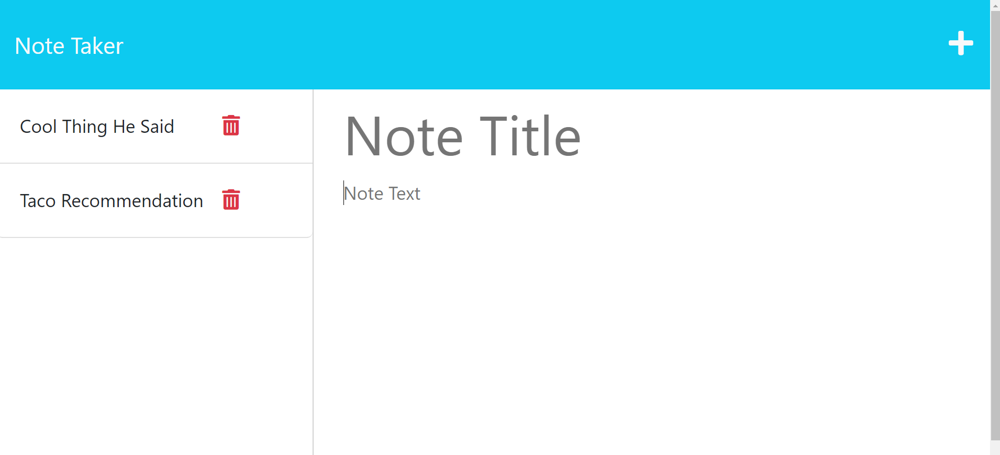

# Jotting Notetaker

## Table of Contents
* [License](#license)  
* [Description](#description)
* [Screenshot](#screenshot) 
* [Questions](#questions)

## Description    
Jotting Notetaker is an app designed for the user to write and save notes! The user may delete, save, view, or edit past notes. 

## License   
MIT License 
* https://choosealicense.com/licenses/mit/

## Screenshot   

## Questions   
* [Github](https://github.com/marissa-a-darr)
* Email: mrsaanadee@gmail.com
* Other Contact: Please send me a message via email 
